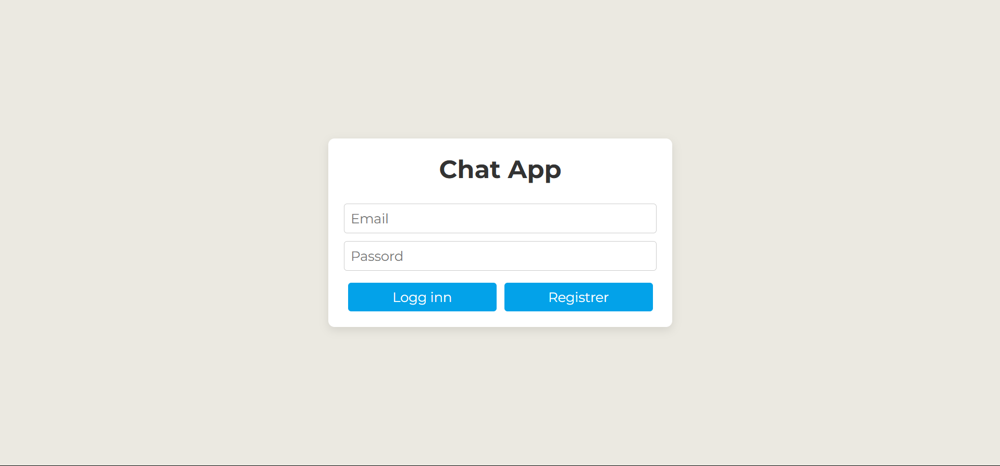

Enkel sanntids chat-applikasjon med Firebase
Utvikle en enkel chat-applikasjon der brukere kan sende og motta meldinger i sanntid.
Database:
- Firebase Authentication (Logg inn - Logg på).
- Meldinger skal lagres med feltene: tekst, timestamp og bruker.
- Nye meldinger skal vises automatisk (real-time oppdatering).
JavaScript:
- Håndtere innlogging og utlogging.
- Sende meldinger og vise dem i sanntid. Slette/Redigere egne meldinger
- Hindre sending av tomme meldinger.
HTML/CSS:
- Brukervennlig grensesnitt: innloggingsskjema, meldingsvisning og input-felt.
- Meldinger vises tydelig (gjerne egne meldinger til høyre, andres til venstre).
Leveringskrav:
- index.html, style.css, script.js må være med
- Firebase må være korrekt satt opp og koblet til prosjektet
- Autentisering må være aktivert
- Brukeren må kunne logge inn og sende/lese meldinger
- Prosjektet skal lastes opp på GitHub
- README.md må inneholde kort beskrivelse og skjermbilder
Utfordring: Utfordringen teller ikke direkte på karakteren, men kan være med på å vise ekstra innsats og ferdigheter
- Vise klokkeslett på meldinger
- Trykk «Enter» for å sende meldinger.
- Privat chat med valgt bruker
- Fargeforskjell mellom egne meldinger og andres
- Mobilvennlig design (responsiv layout)
- Bruker kan velge visningsnavn før meldingene sendes
- Dark mode
- Lage prosjektet med MySQL

# Sanntids Chat-applikasjon med Firebase

En enkel og responsiv chat-applikasjon som lar brukere registrere seg, logge inn, og chatte i sanntid.

## Funksjonalitet

- **Brukerautentisering**:
  - Registrering og innlogging med e-post og passord
  - Mulighet for å sette visningsnavn
  - Sikker utlogging

- **Meldingsfunksjonalitet**:
  - Sende og motta meldinger i sanntid
  - Redigere egne meldinger
  - Slette egne meldinger
  - Vis tidsstempel på alle meldinger
  - Trykk Enter for å sende melding

- **UI-funksjoner**:
  - Brukervennlig grensesnitt med god lesbarhet
  - Responsivt design som fungerer på alle enheter
  - Dark Mode / Light Mode med husking av preferanse
  - Tydelig skille mellom egne og andres meldinger

## Teknologier brukt

- **Frontend**: HTML, CSS, JavaScript
- **Backend**: Firebase (Firestore, Authentication)
- **Sanntidsoppdatering**: Firebase Realtime Listeners

## Installasjon og oppsett

1. Klon dette repositoriet:
   ```
   git clone https://github.com/SanteriWille/chat-app-firebase.git
   ```

2. Åpne `index.html` i nettleseren din eller bruk en lokal server.

3. Registrer deg med e-post og passord for å begynne å chatte.

## Firebase-konfigurasjon

Applikasjonen er allerede konfigurert med Firebase, men hvis du ønsker å bruke din egen Firebase-konfigurasjon:

1. Opprett et nytt prosjekt på [Firebase Console](https://console.firebase.google.com/)
2. Aktiver Authentication (med e-post/passord)
3. Opprett en Firestore-database
4. Erstatt Firebase-konfigurasjonsobjektet i `script.js` med din egen

## Utfordringer implementert

- ✅ Vise klokkeslett på meldinger
- ✅ Trykk "Enter" for å sende meldinger
- ✅ Fargeforskjell mellom egne meldinger og andres
- ✅ Mobilvennlig design (responsiv layout)
- ✅ Bruker kan velge visningsnavn før meldingene sendes
- ✅ Dark mode

## Refleksjoner og læring

Gjennom utviklingen av denne chat-applikasjonen har jeg lært mye om:

- Hvordan Firebase Authentication og Firestore fungerer sammen
- Håndtering av sanntidsoppdateringer med Firebase
- Responsivt design for ulike skjermstørrelser
- Implementering av mørk/lys tema
- CRUD-operasjoner i Firestore (Create, Read, Update, Delete)

## Fremtidige forbedringer

- Implementere privat chat mellom brukere
- Legge til mulighet for å sende bilder og filer
- Implementere notifikasjoner for nye meldinger
- Emoji-støtte i meldinger

## Skjermbilder


